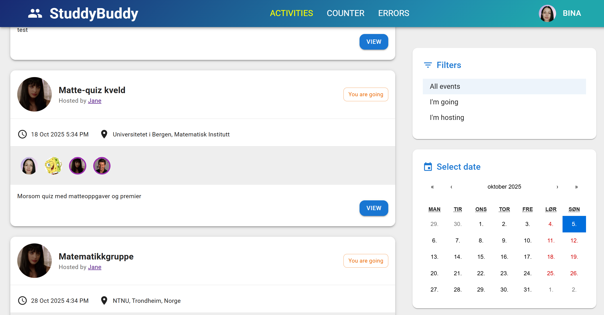

# StudyBuddy 🎓

  

  

**StudyBuddy** is a social web application for students to organize and join study meetings and events.  
Users can create, attend, and manage activities, follow or unfollow other students, and customize their profiles.  
Built with **.NET 9**, **React 19**, **React Query**, and **Material UI**, following **Clean Architecture** and **CQRS + MediatR** patterns.

---

## 🌐 Live Demo

🔗 **Live mode available:**  
[https://studybuddy-f4c7aueehpckefc9.northeurope-01.azurewebsites.net](https://studybuddy-f4c7aueehpckefc9.northeurope-01.azurewebsites.net/)

You can log in with the demo account:  
📧 Email: dyakovabina@gmail.com  
🔑 Password: Pa$$w0rd

---

## ✨ Features

- 📅 Create, edit, and cancel activities (study meetings or events)  
- 🧑‍🤝‍🧑 Follow and unfollow other users  
- ✅ Join or cancel attendance for events  
- 🧍‍♀️ View other students’ profiles  
- 🖼️ Upload and update profile photos (Cloudinary integration)  
- ✏️ Edit personal information  
- 🔒 Authentication with ASP.NET Core Identity and GitHub OAuth  
- 📧 Email verification & password reset (Resend integration)  
- ⚡ Real-time updates and chat (SignalR)  
- 🎨 Modern UI using **Material UI (MUI)**  
- ☁️ Fully deployed to **Azure**
- 🔍 Filter activities by date, by all, hosting, or attending

---

## 🧩 Tech Stack

**Frontend**
- React 19 + TypeScript  
- React Query  
- React Hook Form + Zod  
- React Router  
- Axios  
- **Material UI (MUI)**  

**Backend**
- ASP.NET Core 9 Web API  
- Entity Framework Core  
- CQRS + MediatR pattern  
- Cloudinary (image hosting)  
- Resend (email service)  
- SignalR (real-time communication)  
- Azure App Service  
- Docker  

---

## ⚙️ Local Setup
### 1️⃣ Clone the repository

```bash
git clone https://github.com/your-username/studybuddy.git
cd studybuddy
```

### 2️⃣ Create an `appsettings.json` file in the **API** project and fill in your own credentials:

```json
{
  "Logging": {
    "LogLevel": {
      "Default": "Information",
      "Microsoft.AspNetCore": "Warning"
    }
  },
  "ConnectionStrings": {
    "DefaultConnection": "YOUR_DATABASE_CONNECTION_STRING"
  },
  "CloudinarySettings": {
    "CloudName": "YOUR_CLOUDINARY_CLOUD_NAME",
    "ApiKey": "YOUR_CLOUDINARY_API_KEY",
    "ApiSecret": "YOUR_CLOUDINARY_API_SECRET"
  },
  "Resend": {
    "ApiToken": "YOUR_RESEND_API_TOKEN"
  },
  "Authentication": {
    "GitHub": {
      "ClientId": "YOUR_GITHUB_CLIENT_ID",
      "ClientSecret": "YOUR_GITHUB_CLIENT_SECRET"
    }
  },
  "AllowedHosts": "*",
  "ClientAppUrl": "https://localhost:3000"
}
````


### 3️⃣ Local Database Setup with Docker & SQL Server

1️⃣ Change the SA password in your docker-compose.yml file:

```bash
MSSQL_SA_PASSWORD: "Your password"
```

2️⃣ Start the container:

```bash
docker compose up -d
```

You can optionally open Docker Dashboard to verify that the container is running.

SQL Server will be available at localhost,1433.

3️⃣ Update appsettings.Development.json connection string:

```bash
"ConnectionStrings": {
  "DefaultConnection": "Server=localhost,1433;Database=Your DB name;User Id=sa;Password=Your password;TrustServerCertificate=True;"
}
```

4️⃣  Apply the migration:
```bash
dotnet ef database update -p Persistence -s Api
```

### 4️⃣ Run the application

Start the backend:
```bash
cd Api
dotnet run
```

The API will run on https://localhost:5001

You don’t need to start the frontend separately if it’s already built or served by the API.

##  📚 Course Inspiration

This project was built as part of **“The Complete Guide to Building an App from Start to Finish using .NET 9.0, React 19, and React Query”** course on **Udemy**.
